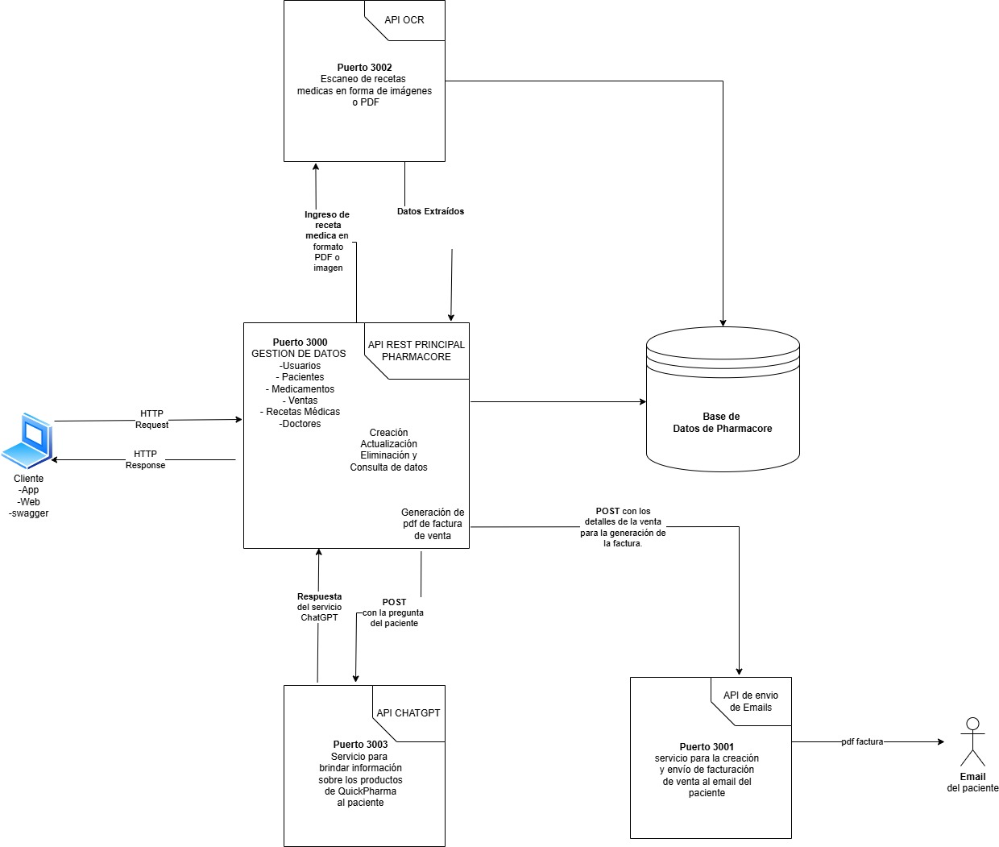
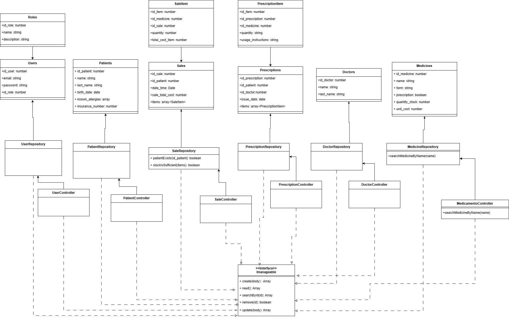
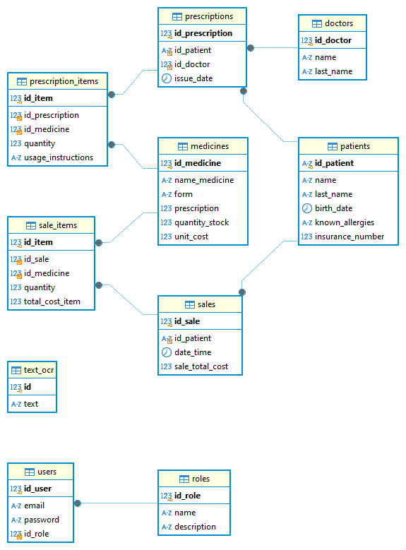

# PharmaCore-TS 
## Descripción
PharmaCore es una aplicación integral diseñada para gestionar de manera eficiente recetas médicas, perfiles de pacientes, inventario de medicamentos y ventas.
Además, incorpora funcionalidades avanzadas como el envío automatizado de facturas por correo electrónico, el reconocimiento de texto a partir de archivos PDF o imágenes, y la integración con ChatGPT para realizar búsquedas avanzadas de información sobre medicamentos.

## Tecnologias 
- TypeScript (Entorno  Node.js)
- MySQL

## otras tecnologías y framework
- Express 
- Swagger (for API documentation)
- tesseract (OCR)
- Chat GPT
- Git 

## Uso
- Para ejecutar: npm ruv dev 

# Endpoints

##  Operaciones relacionadas a Ventas


### POST: /api/v1/sales
Genera una nueva venta

### Ejemplo del request body:
```json
{
  "id_patient": "263637",
  "date_time": "2024-11-27",
  "items": [
    {
      "id_medicine": 2 ,
      "quantity": 10
    },
    {"id_medicine": 4 ,
      "quantity": 20
    }
  ]
}
```

### Ejemplo de la respuesta:
```json
{
  "id_sale": 29,
  "id_patient": "263637",
  "date_time": "2024-11-27T00:00:00.000Z",
  "items": [
    {
      "id_medicine": 2,
      "quantity": 10,
      "id_sale": 29,
      "id_item": 42
    },
    {
      "id_medicine": 4,
      "quantity": 20,
      "id_sale": 29,
      "id_item": 43
    }
  ]
}
```
### GET: /api/v1/sales
Obtiene una lista de las ventas actuales

### No requiere request body

### Ejemplo de la respuesta:
```json
[
  {
    "id_sale": 2,
    "id_patient": "1",
    "date_time": "2024-11-18T05:00:00.000Z",
    "sale_total_cost": 10000
  },
  {
    "id_sale": 3,
    "id_patient": "53556",
    "date_time": "2024-11-19T05:00:00.000Z",
    "sale_total_cost": 38000
  }
]
```
### PUT: /api/v1/sales/
Actualiza la información de una venta existente.  

### Ejemplo del request body:
```json
{
  "id_sale": 6,
  "id_patient": "746464",
  "date_time": "2024-11-27",
  "sale_total_cost": 35000,
  "items": [
    {
      "id_item": 26,
      "id_sale": 6,
      "id_medicine": 2,
      "quantity": 1,
      "item_total_cost": 15000
    },
 {
      "id_item": 27,
      "id_sale": 6,
      "id_medicine": 4,
      "quantity": 1,
      "item_total_cost": 10000
    }
  ]
}
```
### Ejemplo de la respuesta:
```json
{
  "id_sale": 6,
  "id_patient": "746464",
  "date_time": "2024-11-27T00:00:00.000Z",
  "sale_total_cost": 35000,
  "items": [
    {
      "id_item": 44,
      "id_sale": 6,
      "id_medicine": 2,
      "quantity": 1,
      "item_total_cost": 15000
    },
    {
      "id_item": 45,
      "id_sale": 6,
      "id_medicine": 4,
      "quantity": 1,
      "item_total_cost": 10000
    }
  ]
}
```
### GET: /api/v1/sales/{id}
obtiene una venta con un id de venta proporsionado 

### Request:  
/api/v1/sales/id

### Ejemplo de la respuesta:
```json
  {
  "id_sale": 18,
  "id_patient": "263637",
  "date_time": "2024-11-20T05:00:00.000Z",
  "sale_total_cost": 50000,
  "items": [
    {
      "id_item": 23,
      "id_sale": 18,
      "id_medicine": 1,
      "quantity": 30,
      "item_total_cost": 15000
    }
    ]
  }
  ```
### DELETE: /api/v1/sales/{id}
Elimina una venta con un id de venta proporsionado 

### Request:  
/api/v1/sales/id

### Ejemplo de la respuesta:
true

## Operaciones relacionadas a Medicamentos

### POST: /api/v1/medicine  
Crea un nuevo medicamento en el sistema.  

### Ejemplo del request body:
{
  "name_medicine": "Paracetamol",
  "form": "Tableta",
  "prescription": true,
  "quantity_stock": 500,
  "unit_cost": 50
}

### Ejemplo de la respuesta:
```json
{
  "id_medicine": 1,
  "name_medicine": "Paracetamol",
  "form": "Tableta",
  "prescription": true,
  "quantity_stock": 500,
  "unit_cost": 50
}
```
### GET: /api/v1/medicine  
Obtiene una lista de los medicamentos disponibles en el inventario.  

### No requiere request body  

### Ejemplo de la respuesta:
```json
[
  {
    "id_medicine": 1,
    "name_medicine": "Paracetamol",
    "form": "Tableta",
    "prescription": true,
    "quantity_stock": 500,
    "unit_cost": 50
  },
  {
    "id_medicine": 2,
    "name_medicine": "Ibuprofeno",
    "form": "Cápsula",
    "prescription": false,
    "quantity_stock": 300,
    "unit_cost": 80
  }
]
```
### GET: /api/v1/medicine/{id}  
Obtiene la información de un medicamento específico, identificado por su ID.  

### Request:  
/api/v1/medicine/{id}  

### Ejemplo de la respuesta:
```json
{
  "id_medicine": 1,
  "name_medicine": "Paracetamol",
  "form": "Tableta",
  "prescription": true,
  "quantity_stock": 500,
  "unit_cost": 50
}
```
### GET: /api/v1/medicine/{name}  
Obtiene la información de un medicamento específico, identificado por su nombre.  

### Request:  
/api/v1/medicine/{name}  

### Ejemplo de la respuesta:
```json
{
  "id_medicine": 1,
  "name_medicine": "Paracetamol",
  "form": "Tableta",
  "prescription": true,
  "quantity_stock": 500,
  "unit_cost": 50
}
```
### PUT: /api/v1/medicine/  
Actualiza la información de un medicamento existente.  

### Ejemplo del request body:
```json
{
  "id_medicine": 1,
  "name_medicine": "Paracetamol 500mg",
  "form": "Tableta",
  "prescription": true,
  "quantity_stock": 450,
  "unit_cost": 55
}
```
### Ejemplo de la respuesta:
```json
{
  "id_medicine": 1,
  "name_medicine": "Paracetamol 500mg",
  "form": "Tableta",
  "prescription": true,
  "quantity_stock": 450,
  "unit_cost": 55
}
```
### DELETE: /api/v1/medicine/{id}  
Elimina un medicamento del inventario, identificado por su ID.  

### Request:  
/api/v1/medicine/{id}  

### Ejemplo de la respuesta:
true

## Operaciones relacionadas a Pacientes

### POST: /api/v1/patients  
Crea un nuevo paciente en el sistema.  

### Ejemplo del request body:
```json
{
  "id_patient": "70054896",
  "name": "Juan",
  "last_name": "Pérez",
  "birth_date": "1990-01-01",
  "known_allergies": "Penicilina",
  "insurance_number": "123456789"
}
```
### Ejemplo de la respuesta:
```json
{
  "id_patient": "70054896",
  "name": "Juan",
  "last_name": "Pérez",
  "birth_date": "1990-01-01",
  "known_allergies": "Penicilina",
  "insurance_number": "123456789"
}
```
### GET: /api/v1/patients  
Obtiene una lista de los pacientes registrados en el sistema.  

### No requiere request body  

### Ejemplo de la respuesta:
```json
[
  {
    "id_patient": "70054896",
    "name": "Juan",
    "last_name": "Perez",
    "birth_date": "1990-01-01",
    "known_allergies": "Penicilina",
    "insurance_number": "123456789"
  },
  {
    "id_patient": "5964823",
    "name": "Maria",
    "last_name": "López",
    "birth_date": "1985-05-15",
    "known_allergies": "Aspirina",
    "insurance_number": "987654321"
  }
]
```
### GET: /api/v1/patients/{id}  
Obtiene la información de un paciente específico, identificado por su ID.  

### Request:  
/api/v1/patients/{id}  

### Ejemplo de la respuesta:
```json
{
  "id_patient": "70054896",
  "name": "Juan",
  "last_name": "Perez",
  "birth_date": "1990-01-01",
  "known_allergies": "Penicilina",
  "insurance_number": "123456789"
}
```
### PUT: /api/v1/patients/
Actualiza la información de un paciente existente.  

### Ejemplo del request body:
```json
{
  "id_patient": "70054896",
  "name": "Juan Carlos",
  "last_name": "Perez",
  "birth_date": "1990-01-01",
  "known_allergies": "Penicilina, Ibuprofeno",
  "insurance_number": "123456789"
}
```
### Ejemplo de la respuesta:
```json
{
  "id_patient": "70054896",
  "name": "Juan Carlos",
  "last_name": "Pérez",
  "birth_date": "1990-01-01",
  "known_allergies": "Penicilina, Ibuprofeno",
  "insurance_number": "123456789"
}
```
### DELETE: /api/v1/patients/{id}  
Elimina un paciente del sistema, identificado por su ID.  

### Request:  
/api/v1/patients/{id}  

### Ejemplo de la respuesta:
true

## Operaciones relacionadas a Usuarios

### POST: /api/v1/users  
Crea un nuevo usuario en el sistema.  

### Ejemplo del request body:
```json
{
  "email": "usuario@example.com",
  "password": "password123",
  "id_role": 1
}
```
### Ejemplo de la respuesta:
```json
{
  "email": "correo@correo.com",
  "password": "clavecorreo1",
  "id_role": 2
}
```
### GET: /api/v1/users  
Obtiene una lista de los usuarios registrados en el sistema.  

### No requiere request body  

### Ejemplo de la respuesta:
```json
[
  {
    "id_user": 1,
    "email": "nose",
    "password": "nose",
    "id_role": 1
  },
  {
    "id_user": 4,
    "email": "facilito1@gmail.com",
    "password": "privado23",
    "id_role": 1
  }
]
```
### GET: /api/v1/users/{id}  
Obtiene la información de un usuario específico, identificado por su ID.  

### Request:  
/api/v1/users/{id}  

### Ejemplo de la respuesta:
```json
{
  "id_user": 4,
    "email": "facilito1@gmail.com",
    "password": "privado23",
    "id_role": 1
}
```
### PUT: /api/v1/users/ 
Actualiza la información de un usuario existente.  

### Ejemplo del request body:
```json
{
  "id_user": 4,
  "email": "usuario_actualizado@example.com",
  "password": "nuevoPassword123",
  "id_role": 2
}
```
### Ejemplo de la respuesta:
```json
{
  "id_user": 4,
  "email": "usuario_actualizado@example.com",
  "password": "nuevoPassword123",
  "id_role": 2
}
```
### DELETE: /api/v1/users/{id}  
Elimina un usuario del sistema, identificado por su ID.  

### Request:  
/api/v1/users/{id}  

### Ejemplo de la respuesta:
true

## Operaciones relacionadas a Recetas

### POST: /api/v1/prescriptions  
Crea una nueva receta médica en el sistema.  

### Ejemplo del request body:
```json
{
  "id_patient": "12345",
  "id_doctor": "67890",
  "issue_date": "2024-11-27",
  "items": [
    {
      "id_medicine": 1,
      "quantity": 2,
      "usage_instructions": "Tomar una tableta cada 8 horas."
    },
    {
      "id_medicine": 2,
      "quantity": 1,
      "usage_instructions": "Aplicar una vez al día."
    }
  ]
}
```
### Ejemplo de la respuesta:
```json
{
  "id_prescription": 1,
  "id_patient": "12345",
  "id_doctor": "67890",
  "issue_date": "2024-11-27",
  "items": [
    {
      "id_item": 1,
      "id_prescription": 1,
      "id_medicine": 1,
      "quantity": 2,
      "usage_instructions": "Tomar una tableta cada 8 horas."
    },
    {
      "id_item": 2,
      "id_prescription": 1,
      "id_medicine": 2,
      "quantity": 1,
      "usage_instructions": "Aplicar una vez al día."
    }
  ]
}
```
### GET: /api/v1/prescriptions  
Obtiene una lista de las recetas registradas en el sistema.  

### No requiere request body  

### Ejemplo de la respuesta:
```json
[
  {
    "id_prescription": 1,
    "id_patient": "12345",
    "id_doctor": "67890",
    "issue_date": "2024-11-27",
    "items": [
      {
        "id_item": 1,
        "id_medicine": 1,
        "quantity": 2,
        "usage_instructions": "Tomar una tableta cada 8 horas."
      },
      {
        "id_item": 2,
        "id_medicine": 2,
        "quantity": 1,
        "usage_instructions": "Aplicar una vez al día."
      }
    ]
  }
]
```
### GET: /api/v1/prescriptions/{id}  
Obtiene la información de una receta específica, identificada por su ID.  

### Request:  
/api/v1/prescriptions/{id}  

### Ejemplo de la respuesta:
```json
{
  "id_prescription": 1,
  "id_patient": "12345",
  "id_doctor": "67890",
  "issue_date": "2024-11-27",
  "items": [
    {
      "id_item": 1,
      "id_medicine": 1,
      "quantity": 2,
      "usage_instructions": "Tomar una tableta cada 8 horas."
    },
    {
      "id_item": 2,
      "id_medicine": 2,
      "quantity": 1,
      "usage_instructions": "Aplicar una vez al día."
    }
  ]
}
```
### PUT: /api/v1/prescriptions/  
Actualiza la información de una receta médica existente.  

### Ejemplo del request body:
```json
{
  "id_prescription": 1,
  "id_patient": "12345",
  "id_doctor": "67890",
  "issue_date": "2024-11-27",
  "items": [
    {
      "id_item": 1,
      "id_medicine": 1,
      "quantity": 2,
      "usage_instructions": "Tomar una tableta cada 6 horas."
    },
  ]
}
```
### Ejemplo de la respuesta:
```json
{
  "id_prescription": 1,
  "id_patient": "12345",
  "id_doctor": "67890",
  "issue_date": "2024-11-28",
  "items": [
    {
      "id_item": 1,
      "id_medicine": 1,
      "quantity": 2,
      "usage_instructions": "Tomar una tableta cada 6 horas."
    }
  ]
}
```
### DELETE: /api/v1/prescriptions/{id}  
Elimina una receta del sistema, identificada por su ID.  

### Request:  
/api/v1/prescriptions/{id}  

### Ejemplo de la respuesta:
true

## Operaciones relacionadas a Doctores

### POST: /api/v1/doctors  
Crea un nuevo doctor en el sistema.  

### Ejemplo del request body:
```json
{
  "id_doctor": 1,
  "name": "Carlos",
  "last_name": "Gomez"
}
```
### Ejemplo de la respuesta:
```json
{
  "id_doctor": 1,
  "name": "Carlos",
  "last_name": "Gomez"
}
```
### GET: /api/v1/doctors  
Obtiene una lista de los doctores registrados en el sistema.  

### No requiere request body  

### Ejemplo de la respuesta:
```json
[
  {
    "id_doctor": 1,
    "name": "Carlos",
    "last_name": "Gómez"
  },
  {
    "id_doctor": 2,
    "name": "Maria",
    "last_name": "Lopez"
  }
]
```
### GET: /api/v1/doctors/{id}  
Obtiene la información de un doctor específico, identificado por su ID.  

### Request:  
/api/v1/doctors/{id}  

### Ejemplo de la respuesta:
```json
{
  "id_doctor": 1,
  "name": "Carlos",
  "last_name": "Gomez"
}
```
### PUT: /api/v1/doctors/
Actualiza la información de un doctor existente.  

### Ejemplo del request body:
```json
{
  "id_doctor": 1,
  "name": "Carlos Alberto",
  "last_name": "Gómez Pérez"
}
```
### Ejemplo de la respuesta:
```json
{
  "id_doctor": 1,
  "name": "Carlos Alberto",
  "last_name": "Gómez Pérez"
}
```
### DELETE: /api/v1/doctors/{id}  
Elimina un doctor del sistema, identificado por su ID.  

### Request:  
/api/v1/doctors/{id}  

### Ejemplo de la respuesta:
true

# Endpoints de microservicios
 
## Notificaciones


### Request:  
POST: /api/v1/notificacion/correo/{id}

### Body:
```json
{
  "to": "user@correo.com"
}
```
### Ejemplo de la respuesta:
```json
{
  "ok": true,
  "message": "string"
}
```
## Reconocimiento Óptico de Caracteres (OCR)

### Caso de cargue de imagen:

### Request:   
POST:  /api/v1/images

- Se carga el archivo de imagen 

### Ejemplo de la respuesta:
```json
{
  "data": [
    "Texto de la receta médica"
  ]  
}
```
### Caso de cargue de PDF:

### Request:   
POST:  /api/v1/pdf

- Se carga el archivo de pdf 

### Ejemplo de la respuesta:
```json
{
  "data": [
    "Texto de la receta médica"
  ]  
}
```
## Chat GPT

### Request:   
POST:  /api/v1/chatgpt
```json
{
  "question": "¿Cuáles son los efectos secundarios del uso del paracetamol?",
  "productContext": "El Paracetamol es un medicamento que se utiliza para tratar enfermedades relacionadas con el sistema nervioso."
}
```
### Ejemplo de la respuesta:
```json
{
  "answer": "El paracetamol puede causar efectos secundarios como náuseas, vómitos, dolor de cabeza, mareos y somnolencia."
}
```
# Diagramas

## Diagrama de Secuencia 



## Diagrama UML 



## Diagrama Entidad Relacion



# Creacion de bases de datos (mysql o postgresql)

```sql
CREATE DATABASE `railway` 


-- railway.doctors definition

CREATE TABLE `doctors` (
  `id_doctor` int NOT NULL,
  `name` varchar(100) CHARACTER SET utf8mb4 COLLATE utf8mb4_persian_ci NOT NULL,
  `last_name` varchar(100) CHARACTER SET utf8mb4 COLLATE utf8mb4_persian_ci NOT NULL,
  PRIMARY KEY (`id_doctor`)
) 


-- railway.medicines definition

CREATE TABLE `medicines` (
  `id_medicine` int NOT NULL AUTO_INCREMENT,
  `name_medicine` varchar(100) CHARACTER SET utf8mb4 COLLATE utf8mb4_persian_ci NOT NULL,
  `form` varchar(100) CHARACTER SET utf8mb4 COLLATE utf8mb4_persian_ci NOT NULL,
  `prescription` tinyint(1) NOT NULL,
  `quantity_stock` int NOT NULL,
  `unit_cost` int NOT NULL,
  PRIMARY KEY (`id_medicine`)
) ENGINE=InnoDB AUTO_INCREMENT=5 DEFAULT CHARSET=utf8mb4 COLLATE=utf8mb4_persian_ci;


-- railway.patients definition

CREATE TABLE `patients` (
  `id_patient` varchar(10) COLLATE utf8mb4_persian_ci NOT NULL,
  `name` varchar(100) CHARACTER SET utf8mb4 COLLATE utf8mb4_persian_ci NOT NULL,
  `last_name` varchar(100) CHARACTER SET utf8mb4 COLLATE utf8mb4_persian_ci NOT NULL,
  `birth_date` datetime NOT NULL,
  `known_allergies` varchar(200) CHARACTER SET utf8mb4 COLLATE utf8mb4_persian_ci NOT NULL,
  `insurance_number` int DEFAULT NULL,
  PRIMARY KEY (`id_patient`)
) 


-- railway.roles definition

CREATE TABLE `roles` (
  `id_role` int NOT NULL AUTO_INCREMENT,
  `name` varchar(100) CHARACTER SET utf8mb4 COLLATE utf8mb4_persian_ci NOT NULL,
  `description` varchar(200) CHARACTER SET utf8mb4 COLLATE utf8mb4_persian_ci DEFAULT NULL,
  PRIMARY KEY (`id_role`)
) 


-- railway.text_ocr definition

CREATE TABLE `text_ocr` (
  `id` int NOT NULL AUTO_INCREMENT,
  `text` varchar(8000) NOT NULL,
  PRIMARY KEY (`id`)
) 


-- railway.prescriptions definition

CREATE TABLE `prescriptions` (
  `id_prescription` int NOT NULL AUTO_INCREMENT,
  `id_patient` varchar(10) COLLATE utf8mb4_persian_ci NOT NULL,
  `id_doctor` int NOT NULL,
  `issue_date` datetime NOT NULL,
  PRIMARY KEY (`id_prescription`),
  KEY `recetas_pacientes_FK` (`id_patient`),
  KEY `recetas_medicos_FK` (`id_doctor`),
  CONSTRAINT `prescriptions_doctors_FK` FOREIGN KEY (`id_doctor`) REFERENCES `doctors` (`id_doctor`),
  CONSTRAINT `prescriptions_patients_FK` FOREIGN KEY (`id_patient`) REFERENCES `patients` (`id_patient`)
) 


-- railway.sales definition

CREATE TABLE `sales` (
  `id_sale` int NOT NULL AUTO_INCREMENT,
  `id_patient` varchar(10) COLLATE utf8mb4_persian_ci NOT NULL,
  `date_time` date NOT NULL,
  `sale_total_cost` double DEFAULT NULL,
  PRIMARY KEY (`id_sale`),
  KEY `ventas_pacientes_FK` (`id_patient`),
  CONSTRAINT `sales_patients_FK` FOREIGN KEY (`id_patient`) REFERENCES `patients` (`id_patient`)
) 


-- railway.users definition

CREATE TABLE `users` (
  `id_user` int NOT NULL AUTO_INCREMENT,
  `email` varchar(100) CHARACTER SET utf8mb4 COLLATE utf8mb4_persian_ci NOT NULL,
  `password` varchar(100) CHARACTER SET utf8mb4 COLLATE utf8mb4_persian_ci NOT NULL,
  `id_role` int NOT NULL,
  PRIMARY KEY (`id_user`),
  KEY `users_roles_FK` (`id_role`),
  CONSTRAINT `users_roles_FK` FOREIGN KEY (`id_role`) REFERENCES `roles` (`id_role`)
) 


-- railway.prescription_items definition

CREATE TABLE `prescription_items` (
  `id_item` int NOT NULL AUTO_INCREMENT,
  `id_prescription` int NOT NULL,
  `id_medicine` int NOT NULL,
  `quantity` int NOT NULL,
  `usage_instructions` varchar(300) CHARACTER SET utf8mb4 COLLATE utf8mb4_persian_ci NOT NULL,
  PRIMARY KEY (`id_item`),
  KEY `item_prescriptions_prescriptions_FK` (`id_prescription`),
  KEY `item_prescriptions_medicines_FK` (`id_medicine`),
  CONSTRAINT `item_prescriptions_medicines_FK` FOREIGN KEY (`id_medicine`) REFERENCES `medicines` (`id_medicine`),
  CONSTRAINT `item_prescriptions_prescriptions_FK` FOREIGN KEY (`id_prescription`) REFERENCES `prescriptions` (`id_prescription`)
) 


-- railway.sale_items definition

CREATE TABLE `sale_items` (
  `id_item` int NOT NULL AUTO_INCREMENT,
  `id_sale` int NOT NULL,
  `id_medicine` int NOT NULL,
  `quantity` int NOT NULL,
  `total_cost_item` double DEFAULT NULL,
  PRIMARY KEY (`id_item`),
  KEY `item_sales_sales_FK` (`id_sale`),
  KEY `item_sales_medicines_FK` (`id_medicine`),
  CONSTRAINT `item_sales_medicines_FK` FOREIGN KEY (`id_medicine`) REFERENCES `medicines` (`id_medicine`),
  CONSTRAINT `item_sales_sales_FK` FOREIGN KEY (`id_sale`) REFERENCES `sales` (`id_sale`)
) 


