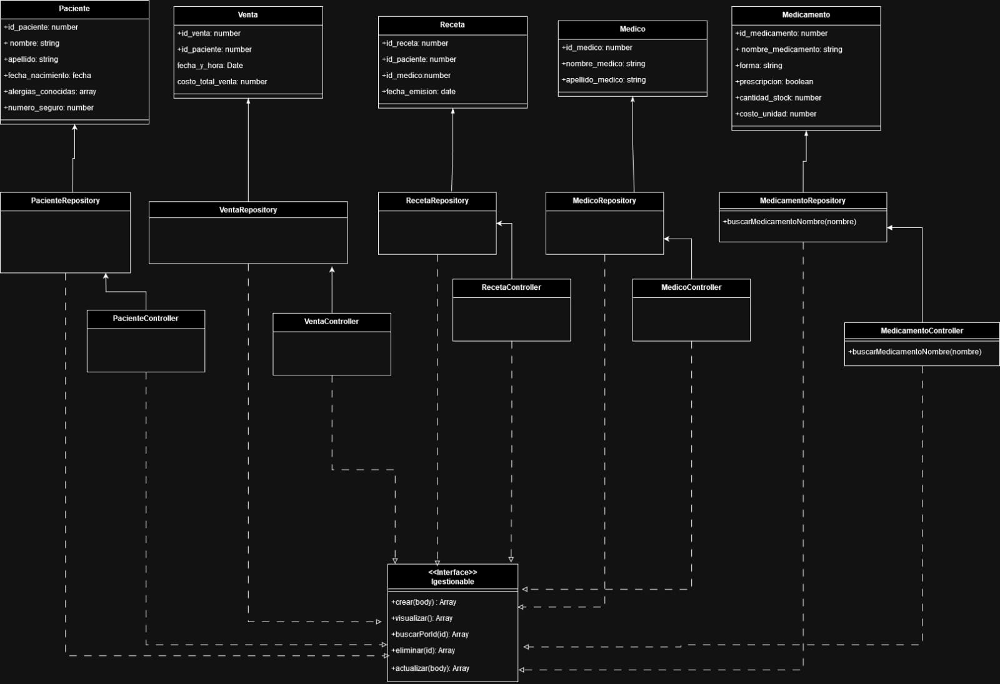
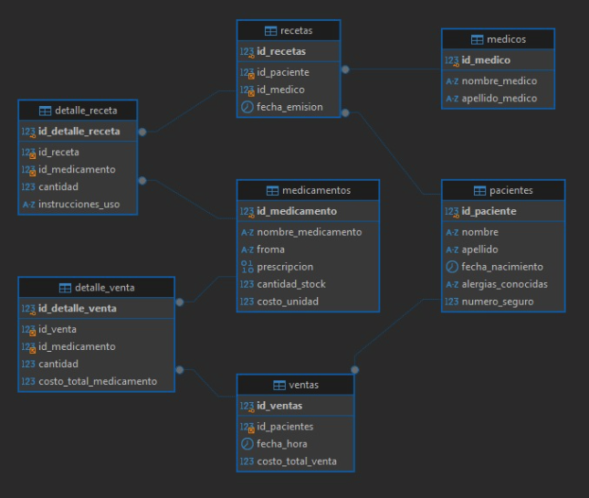

# PharmaCore-TS 
## Descripción
PharmaCore es una aplicación robusta diseñada para gestionar eficientemente recetas médicas, perfiles de pacientes, inventario de medicamentos y ventas, asegurando la integridad y la seguridad de los datos de salud.

## sprint 1

1. Diagrama UML



2. Diagrama Entidad Relacion



3. Creacion de bases de datos (mysql o postgresql)
```sql
CREATE DATABASE `quickpharma`;

-- quickpharma.medicamentos definition

CREATE TABLE `medicamentos` (
  `id_medicamento` int NOT NULL,
  `nombre_medicamento` varchar(100) COLLATE utf8mb4_persian_ci NOT NULL,
  `froma` varchar(100) COLLATE utf8mb4_persian_ci NOT NULL,
  `prescripcion` binary(1) NOT NULL,
  `cantidad_stock` int NOT NULL,
  `costo_unidad` int NOT NULL,
  PRIMARY KEY (`id_medicamento`)
) 

-- quickpharma.medicos definition

CREATE TABLE `medicos` (
  `id_medico` int NOT NULL,
  `nombre_medico` varchar(100) COLLATE utf8mb4_persian_ci NOT NULL,
  `apellido_medico` varchar(100) COLLATE utf8mb4_persian_ci NOT NULL,
  PRIMARY KEY (`id_medico`)
) 

-- quickpharma.pacientes definition

CREATE TABLE `pacientes` (
  `id_paciente` int NOT NULL,
  `nombre` varchar(100) COLLATE utf8mb4_persian_ci NOT NULL,
  `apellido` varchar(100) COLLATE utf8mb4_persian_ci NOT NULL,
  `fecha_nacimiento` datetime NOT NULL,
  `alergias_conocidas` varchar(200) COLLATE utf8mb4_persian_ci NOT NULL,
  `numero_seguro` int DEFAULT NULL,
  PRIMARY KEY (`id_paciente`)
)

-- quickpharma.recetas definition

CREATE TABLE `recetas` (
  `id_recetas` int NOT NULL,
  `id_paciente` int NOT NULL,
  `id_medico` int NOT NULL,
  `fecha_emision` datetime NOT NULL,
  PRIMARY KEY (`id_recetas`),
  KEY `recetas_pacientes_FK` (`id_paciente`),
  KEY `recetas_medicos_FK` (`id_medico`),
  CONSTRAINT `recetas_medicos_FK` FOREIGN KEY (`id_medico`) REFERENCES `medicos` (`id_medico`),
  CONSTRAINT `recetas_pacientes_FK` FOREIGN KEY (`id_paciente`) REFERENCES `pacientes` (`id_paciente`)
) 

-- quickpharma.ventas definition

CREATE TABLE `ventas` (
  `id_ventas` int NOT NULL,
  `id_pacientes` int NOT NULL,
  `fecha_hora` date NOT NULL,
  `costo_total_venta` double NOT NULL,
  PRIMARY KEY (`id_ventas`),
  KEY `ventas_pacientes_FK` (`id_pacientes`),
  CONSTRAINT `ventas_pacientes_FK` FOREIGN KEY (`id_pacientes`) REFERENCES `pacientes` (`id_paciente`)
)

-- quickpharma.detalle_receta definition

CREATE TABLE `detalle_receta` (
  `id_detalle_receta` int NOT NULL AUTO_INCREMENT,
  `id_receta` int NOT NULL,
  `id_medicamento` int NOT NULL,
  `cantidad` int NOT NULL,
  `instrucciones_uso` varchar(300) COLLATE utf8mb4_persian_ci NOT NULL,
  PRIMARY KEY (`id_detalle_receta`),
  KEY `detalle_receta_recetas_FK` (`id_receta`),
  KEY `detalle_receta_medicamentos_FK` (`id_medicamento`),
  CONSTRAINT `detalle_receta_medicamentos_FK` FOREIGN KEY (`id_medicamento`) REFERENCES `medicamentos` (`id_medicamento`),
  CONSTRAINT `detalle_receta_recetas_FK` FOREIGN KEY (`id_receta`) REFERENCES `recetas` (`id_recetas`)
) 

-- quickpharma.detalle_venta definition

CREATE TABLE `detalle_venta` (
  `id_detalle_venta` int NOT NULL AUTO_INCREMENT,
  `id_venta` int NOT NULL,
  `id_medicamento` int NOT NULL,
  `cantidad` int NOT NULL,
  `costo_total_medicamento` double NOT NULL,
  PRIMARY KEY (`id_detalle_venta`),
  KEY `detalle_venta_ventas_FK` (`id_venta`),
  KEY `detalle_venta_medicamentos_FK` (`id_medicamento`),
  CONSTRAINT `detalle_venta_medicamentos_FK` FOREIGN KEY (`id_medicamento`) REFERENCES `medicamentos` (`id_medicamento`),
  CONSTRAINT `detalle_venta_ventas_FK` FOREIGN KEY (`id_venta`) REFERENCES `ventas` (`id_ventas`)
) 

```
4. Bases de datos desplegada en render.com 

   

5. Proyecto de node creado en github
[Link Repositorio](https://github.com/marcelaW40k/PharmaCore-TS)

6. Colección de Postman creada con los endpoints a usar

```json
{
	"info": {
		"_postman_id": "be4db20c-4189-42fc-8ce7-7d38ea595d5a",
		"name": "PharmaCore",
		"schema": "https://schema.getpostman.com/json/collection/v2.1.0/collection.json",
		"_exporter_id": "27652273"
	},
	"item": [
		{
			"name": "Pacientes",
			"item": [
				{
					"name": "Creación",
					"request": {
						"method": "POST",
						"header": [],
						"body": {
							"mode": "raw",
							"raw": ""
						},
						"url": {
							"raw": "http://localhost:3000/api/v1/pacientes",
							"protocol": "http",
							"host": [
								"localhost"
							],
							"port": "3000",
							"path": [
								"api",
								"v1",
								"pacientes"
							]
						}
					},
					"response": []
				},
				{
					"name": "Actualización",
					"request": {
						"method": "PUT",
						"header": [],
						"body": {
							"mode": "raw",
							"raw": ""
						},
						"url": {
							"raw": "http://localhost:3000/api/v1/pacientes",
							"protocol": "http",
							"host": [
								"localhost"
							],
							"port": "3000",
							"path": [
								"api",
								"v1",
								"pacientes"
							]
						}
					},
					"response": []
				},
				{
					"name": "Lista_Pacientes",
					"request": {
						"method": "GET",
						"header": [],
						"url": {
							"raw": "http://localhost:3000/api/v1/pacientes",
							"protocol": "http",
							"host": [
								"localhost"
							],
							"port": "3000",
							"path": [
								"api",
								"v1",
								"pacientes"
							]
						}
					},
					"response": []
				},
				{
					"name": "Buscar Paciente_id",
					"protocolProfileBehavior": {
						"disableBodyPruning": true
					},
					"request": {
						"method": "GET",
						"header": [],
						"body": {
							"mode": "raw",
							"raw": ""
						},
						"url": {
							"raw": "http://localhost:3000/api/v1/pacientes/1",
							"protocol": "http",
							"host": [
								"localhost"
							],
							"port": "3000",
							"path": [
								"api",
								"v1",
								"pacientes",
								"1"
							]
						}
					},
					"response": []
				},
				{
					"name": "Eliminar",
					"request": {
						"method": "DELETE",
						"header": [],
						"url": {
							"raw": "http://localhost:3000/api/v1/pacientes/2",
							"protocol": "http",
							"host": [
								"localhost"
							],
							"port": "3000",
							"path": [
								"api",
								"v1",
								"pacientes",
								"2"
							]
						}
					},
					"response": []
				}
			]
		},
		{
			"name": "Medicamentos",
			"item": [
				{
					"name": "Creación",
					"request": {
						"method": "POST",
						"header": [],
						"body": {
							"mode": "raw",
							"raw": ""
						},
						"url": {
							"raw": "http://localhost:3000/api/v1/medicamentos",
							"protocol": "http",
							"host": [
								"localhost"
							],
							"port": "3000",
							"path": [
								"api",
								"v1",
								"medicamentos"
							]
						}
					},
					"response": []
				},
				{
					"name": "Actualización",
					"request": {
						"method": "PUT",
						"header": [],
						"body": {
							"mode": "raw",
							"raw": ""
						},
						"url": {
							"raw": "http://localhost:3000/api/v1/medicamentos",
							"protocol": "http",
							"host": [
								"localhost"
							],
							"port": "3000",
							"path": [
								"api",
								"v1",
								"medicamentos"
							]
						}
					},
					"response": []
				},
				{
					"name": "Lista_medicamentos",
					"request": {
						"method": "GET",
						"header": [],
						"url": {
							"raw": "http://localhost:3000/api/v1/medicamentos",
							"protocol": "http",
							"host": [
								"localhost"
							],
							"port": "3000",
							"path": [
								"api",
								"v1",
								"medicamentos"
							]
						}
					},
					"response": []
				},
				{
					"name": "Buscar Medicamentos_id",
					"protocolProfileBehavior": {
						"disableBodyPruning": true
					},
					"request": {
						"method": "GET",
						"header": [],
						"body": {
							"mode": "raw",
							"raw": ""
						},
						"url": {
							"raw": "http://localhost:3000/api/v1/medicamentos/1",
							"protocol": "http",
							"host": [
								"localhost"
							],
							"port": "3000",
							"path": [
								"api",
								"v1",
								"medicamentos",
								"1"
							]
						}
					},
					"response": []
				},
				{
					"name": "Eliminar",
					"request": {
						"method": "DELETE",
						"header": [],
						"url": {
							"raw": "http://localhost:3000/api/v1/medicamentos/2",
							"protocol": "http",
							"host": [
								"localhost"
							],
							"port": "3000",
							"path": [
								"api",
								"v1",
								"medicamentos",
								"2"
							]
						}
					},
					"response": []
				}
			]
		},
		{
			"name": "Recetas_Medicas",
			"item": [
				{
					"name": "Creación",
					"request": {
						"method": "POST",
						"header": [],
						"body": {
							"mode": "raw",
							"raw": ""
						},
						"url": {
							"raw": "http://localhost:3000/api/v1/recetas",
							"protocol": "http",
							"host": [
								"localhost"
							],
							"port": "3000",
							"path": [
								"api",
								"v1",
								"recetas"
							]
						}
					},
					"response": []
				},
				{
					"name": "Actualización",
					"request": {
						"method": "PUT",
						"header": [],
						"body": {
							"mode": "raw",
							"raw": ""
						},
						"url": {
							"raw": "http://localhost:3000/api/v1/recetas",
							"protocol": "http",
							"host": [
								"localhost"
							],
							"port": "3000",
							"path": [
								"api",
								"v1",
								"recetas"
							]
						}
					},
					"response": []
				},
				{
					"name": "Lista_medicamentos",
					"request": {
						"method": "GET",
						"header": [],
						"url": {
							"raw": "http://localhost:3000/api/v1/recetas",
							"protocol": "http",
							"host": [
								"localhost"
							],
							"port": "3000",
							"path": [
								"api",
								"v1",
								"recetas"
							]
						}
					},
					"response": []
				},
				{
					"name": "Buscar Recetas_id",
					"protocolProfileBehavior": {
						"disableBodyPruning": true
					},
					"request": {
						"method": "GET",
						"header": [],
						"body": {
							"mode": "raw",
							"raw": ""
						},
						"url": {
							"raw": "http://localhost:3000/api/v1/recetas/1",
							"protocol": "http",
							"host": [
								"localhost"
							],
							"port": "3000",
							"path": [
								"api",
								"v1",
								"recetas",
								"1"
							]
						}
					},
					"response": []
				},
				{
					"name": "Eliminar",
					"request": {
						"method": "DELETE",
						"header": [],
						"url": {
							"raw": "http://localhost:3000/api/v1/recetas/2",
							"protocol": "http",
							"host": [
								"localhost"
							],
							"port": "3000",
							"path": [
								"api",
								"v1",
								"recetas",
								"2"
							]
						}
					},
					"response": []
				}
			]
		},
		{
			"name": "Ventas",
			"item": [
				{
					"name": "Creación",
					"request": {
						"method": "POST",
						"header": [],
						"body": {
							"mode": "raw",
							"raw": ""
						},
						"url": {
							"raw": "http://localhost:3000/api/v1/ventas",
							"protocol": "http",
							"host": [
								"localhost"
							],
							"port": "3000",
							"path": [
								"api",
								"v1",
								"ventas"
							]
						}
					},
					"response": []
				},
				{
					"name": "Actualización",
					"request": {
						"method": "PUT",
						"header": [],
						"body": {
							"mode": "raw",
							"raw": ""
						},
						"url": {
							"raw": "http://localhost:3000/api/v1/ventas",
							"protocol": "http",
							"host": [
								"localhost"
							],
							"port": "3000",
							"path": [
								"api",
								"v1",
								"ventas"
							]
						}
					},
					"response": []
				},
				{
					"name": "Lista_medicamentos",
					"request": {
						"method": "GET",
						"header": [],
						"url": {
							"raw": "http://localhost:3000/api/v1/ventas",
							"protocol": "http",
							"host": [
								"localhost"
							],
							"port": "3000",
							"path": [
								"api",
								"v1",
								"ventas"
							]
						}
					},
					"response": []
				},
				{
					"name": "Buscar ventas_id",
					"protocolProfileBehavior": {
						"disableBodyPruning": true
					},
					"request": {
						"method": "GET",
						"header": [],
						"body": {
							"mode": "raw",
							"raw": ""
						},
						"url": {
							"raw": "http://localhost:3000/api/v1/ventas/1",
							"protocol": "http",
							"host": [
								"localhost"
							],
							"port": "3000",
							"path": [
								"api",
								"v1",
								"ventas",
								"1"
							]
						}
					},
					"response": []
				},
				{
					"name": "Eliminar",
					"request": {
						"method": "DELETE",
						"header": [],
						"url": {
							"raw": "http://localhost:3000/api/v1/ventas/2",
							"protocol": "http",
							"host": [
								"localhost"
							],
							"port": "3000",
							"path": [
								"api",
								"v1",
								"ventas",
								"2"
							]
						}
					},
					"response": []
				}
			]
		}
	]
}
```


