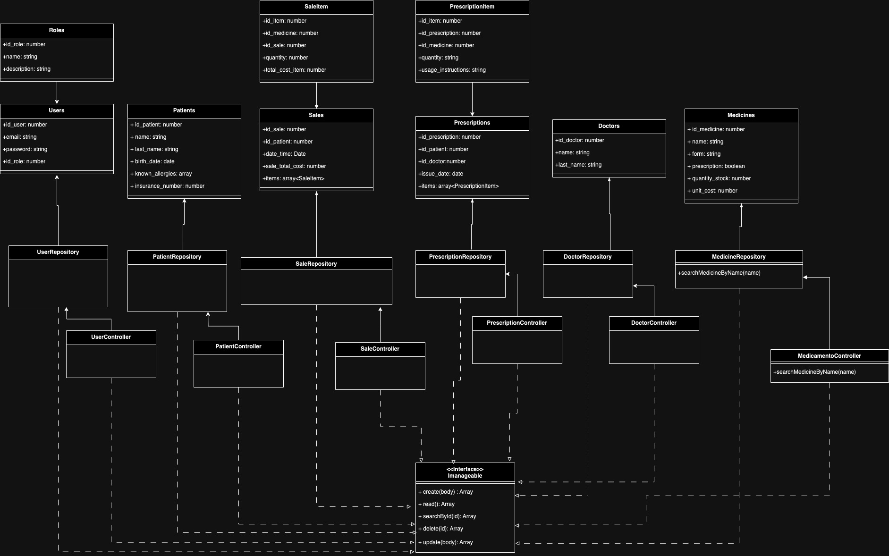
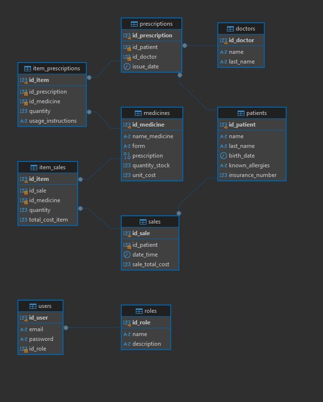
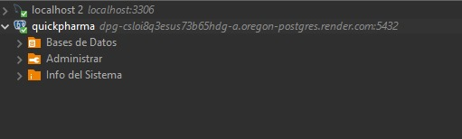

# PharmaCore-TS 
## Descripción
PharmaCore es una aplicación robusta diseñada para gestionar eficientemente recetas médicas, perfiles de pacientes, inventario de medicamentos y ventas, asegurando la integridad y la seguridad de los datos de salud.

## sprint 1

1. Diagrama UML



2. Diagrama Entidad Relacion



3. Creacion de bases de datos (mysql o postgresql)
```sql
CREATE DATABASE `quickpharma`;

-- quickpharma.medicamentos definition

-- quickpharma.doctors definition

CREATE TABLE `doctors` (
  `id_doctor` int NOT NULL,
  `name` varchar(100) CHARACTER SET utf8mb4 COLLATE utf8mb4_persian_ci NOT NULL,
  `last_name` varchar(100) CHARACTER SET utf8mb4 COLLATE utf8mb4_persian_ci NOT NULL,
  PRIMARY KEY (`id_doctor`)
) ENGINE=InnoDB DEFAULT CHARSET=utf8mb4 COLLATE=utf8mb4_persian_ci;


-- quickpharma.medicines definition

CREATE TABLE `medicines` (
  `id_medicine` int NOT NULL AUTO_INCREMENT,
  `name_medicine` varchar(100) CHARACTER SET utf8mb4 COLLATE utf8mb4_persian_ci NOT NULL,
  `form` varchar(100) CHARACTER SET utf8mb4 COLLATE utf8mb4_persian_ci NOT NULL,
  `prescription` binary(1) NOT NULL,
  `quantity_stock` int NOT NULL,
  `unit_cost` int NOT NULL,
  PRIMARY KEY (`id_medicine`)
) ENGINE=InnoDB DEFAULT CHARSET=utf8mb4 COLLATE=utf8mb4_persian_ci;


-- quickpharma.patients definition

CREATE TABLE `patients` (
  `id_patient` int NOT NULL,
  `name` varchar(100) CHARACTER SET utf8mb4 COLLATE utf8mb4_persian_ci NOT NULL,
  `last_name` varchar(100) CHARACTER SET utf8mb4 COLLATE utf8mb4_persian_ci NOT NULL,
  `birth_date` datetime NOT NULL,
  `known_allergies` varchar(200) CHARACTER SET utf8mb4 COLLATE utf8mb4_persian_ci NOT NULL,
  `insurance_number` int DEFAULT NULL,
  PRIMARY KEY (`id_patient`)
) ENGINE=InnoDB DEFAULT CHARSET=utf8mb4 COLLATE=utf8mb4_persian_ci;


-- quickpharma.roles definition

CREATE TABLE `roles` (
  `id_role` int NOT NULL AUTO_INCREMENT,
  `name` varchar(100) COLLATE utf8mb4_persian_ci NOT NULL,
  `description` varchar(200) COLLATE utf8mb4_persian_ci DEFAULT NULL,
  PRIMARY KEY (`id_role`)
) ENGINE=InnoDB DEFAULT CHARSET=utf8mb4 COLLATE=utf8mb4_persian_ci;


-- quickpharma.prescriptions definition

CREATE TABLE `prescriptions` (
  `id_prescription` int NOT NULL AUTO_INCREMENT,
  `id_patient` int NOT NULL,
  `id_doctor` int NOT NULL,
  `issue_date` datetime NOT NULL,
  PRIMARY KEY (`id_prescription`),
  KEY `recetas_pacientes_FK` (`id_patient`),
  KEY `recetas_medicos_FK` (`id_doctor`),
  CONSTRAINT `recetas_medicos_FK` FOREIGN KEY (`id_doctor`) REFERENCES `doctors` (`id_doctor`),
  CONSTRAINT `recetas_pacientes_FK` FOREIGN KEY (`id_patient`) REFERENCES `patients` (`id_patient`)
) ENGINE=InnoDB DEFAULT CHARSET=utf8mb4 COLLATE=utf8mb4_persian_ci;


-- quickpharma.sales definition

CREATE TABLE `sales` (
  `id_sale` int NOT NULL AUTO_INCREMENT,
  `id_patient` int NOT NULL,
  `date_time` date NOT NULL,
  `sale_total_cost` double NOT NULL,
  PRIMARY KEY (`id_sale`),
  KEY `ventas_pacientes_FK` (`id_patient`),
  CONSTRAINT `ventas_pacientes_FK` FOREIGN KEY (`id_patient`) REFERENCES `patients` (`id_patient`)
) ENGINE=InnoDB DEFAULT CHARSET=utf8mb4 COLLATE=utf8mb4_persian_ci;


-- quickpharma.users definition

CREATE TABLE `users` (
  `id_user` int NOT NULL AUTO_INCREMENT,
  `email` varchar(100) COLLATE utf8mb4_persian_ci NOT NULL,
  `password` varchar(100) COLLATE utf8mb4_persian_ci NOT NULL,
  `id_role` int NOT NULL,
  PRIMARY KEY (`id_user`),
  KEY `users_roles_FK` (`id_role`),
  CONSTRAINT `users_roles_FK` FOREIGN KEY (`id_role`) REFERENCES `roles` (`id_role`)
) ENGINE=InnoDB DEFAULT CHARSET=utf8mb4 COLLATE=utf8mb4_persian_ci;


-- quickpharma.item_prescriptions definition

CREATE TABLE `item_prescriptions` (
  `id_item` int NOT NULL AUTO_INCREMENT,
  `id_prescription` int NOT NULL,
  `id_medicine` int NOT NULL,
  `quantity` int NOT NULL,
  `usage_instructions` varchar(300) CHARACTER SET utf8mb4 COLLATE utf8mb4_persian_ci NOT NULL,
  PRIMARY KEY (`id_item`),
  KEY `item_prescriptions_prescriptions_FK` (`id_prescription`),
  KEY `item_prescriptions_medicines_FK` (`id_medicine`),
  CONSTRAINT `item_prescriptions_medicines_FK` FOREIGN KEY (`id_medicine`) REFERENCES `medicines` (`id_medicine`),
  CONSTRAINT `item_prescriptions_prescriptions_FK` FOREIGN KEY (`id_prescription`) REFERENCES `prescriptions` (`id_prescription`)
) ENGINE=InnoDB DEFAULT CHARSET=utf8mb4 COLLATE=utf8mb4_persian_ci;


-- quickpharma.item_sales definition

CREATE TABLE `item_sales` (
  `id_item` int NOT NULL AUTO_INCREMENT,
  `id_sale` int NOT NULL,
  `id_medicine` int NOT NULL,
  `quantity` int NOT NULL,
  `total_cost_item` double NOT NULL,
  PRIMARY KEY (`id_item`),
  KEY `item_sales_sales_FK` (`id_sale`),
  KEY `item_sales_medicines_FK` (`id_medicine`),
  CONSTRAINT `item_sales_medicines_FK` FOREIGN KEY (`id_medicine`) REFERENCES `medicines` (`id_medicine`),
  CONSTRAINT `item_sales_sales_FK` FOREIGN KEY (`id_sale`) REFERENCES `sales` (`id_sale`)
) ENGINE=InnoDB DEFAULT CHARSET=utf8mb4 COLLATE=utf8mb4_persian_ci;
```
4. Bases de datos desplegada en render.com 

   

5. Proyecto de node creado en github
[Link Repositorio](https://github.com/marcelaW40k/PharmaCore-TS)

6. Colección de Postman creada con los endpoints a usar

```json
{
	"info": {
		"_postman_id": "be4db20c-4189-42fc-8ce7-7d38ea595d5a",
		"name": "PharmaCore",
		"schema": "https://schema.getpostman.com/json/collection/v2.1.0/collection.json",
		"_exporter_id": "27652273"
	},
	"item": [
		{
			"name": "Pacientes",
			"item": [
				{
					"name": "Creación",
					"request": {
						"method": "POST",
						"header": [],
						"body": {
							"mode": "raw",
							"raw": ""
						},
						"url": {
							"raw": "http://localhost:3000/api/v1/pacientes",
							"protocol": "http",
							"host": [
								"localhost"
							],
							"port": "3000",
							"path": [
								"api",
								"v1",
								"pacientes"
							]
						}
					},
					"response": []
				},
				{
					"name": "Actualización",
					"request": {
						"method": "PUT",
						"header": [],
						"body": {
							"mode": "raw",
							"raw": ""
						},
						"url": {
							"raw": "http://localhost:3000/api/v1/pacientes",
							"protocol": "http",
							"host": [
								"localhost"
							],
							"port": "3000",
							"path": [
								"api",
								"v1",
								"pacientes"
							]
						}
					},
					"response": []
				},
				{
					"name": "Lista_Pacientes",
					"request": {
						"method": "GET",
						"header": [],
						"url": {
							"raw": "http://localhost:3000/api/v1/pacientes",
							"protocol": "http",
							"host": [
								"localhost"
							],
							"port": "3000",
							"path": [
								"api",
								"v1",
								"pacientes"
							]
						}
					},
					"response": []
				},
				{
					"name": "Buscar Paciente_id",
					"protocolProfileBehavior": {
						"disableBodyPruning": true
					},
					"request": {
						"method": "GET",
						"header": [],
						"body": {
							"mode": "raw",
							"raw": ""
						},
						"url": {
							"raw": "http://localhost:3000/api/v1/pacientes/1",
							"protocol": "http",
							"host": [
								"localhost"
							],
							"port": "3000",
							"path": [
								"api",
								"v1",
								"pacientes",
								"1"
							]
						}
					},
					"response": []
				},
				{
					"name": "Eliminar",
					"request": {
						"method": "DELETE",
						"header": [],
						"url": {
							"raw": "http://localhost:3000/api/v1/pacientes/2",
							"protocol": "http",
							"host": [
								"localhost"
							],
							"port": "3000",
							"path": [
								"api",
								"v1",
								"pacientes",
								"2"
							]
						}
					},
					"response": []
				}
			]
		},
		{
			"name": "Medicamentos",
			"item": [
				{
					"name": "Creación",
					"request": {
						"method": "POST",
						"header": [],
						"body": {
							"mode": "raw",
							"raw": ""
						},
						"url": {
							"raw": "http://localhost:3000/api/v1/medicamentos",
							"protocol": "http",
							"host": [
								"localhost"
							],
							"port": "3000",
							"path": [
								"api",
								"v1",
								"medicamentos"
							]
						}
					},
					"response": []
				},
				{
					"name": "Actualización",
					"request": {
						"method": "PUT",
						"header": [],
						"body": {
							"mode": "raw",
							"raw": ""
						},
						"url": {
							"raw": "http://localhost:3000/api/v1/medicamentos",
							"protocol": "http",
							"host": [
								"localhost"
							],
							"port": "3000",
							"path": [
								"api",
								"v1",
								"medicamentos"
							]
						}
					},
					"response": []
				},
				{
					"name": "Lista_medicamentos",
					"request": {
						"method": "GET",
						"header": [],
						"url": {
							"raw": "http://localhost:3000/api/v1/medicamentos",
							"protocol": "http",
							"host": [
								"localhost"
							],
							"port": "3000",
							"path": [
								"api",
								"v1",
								"medicamentos"
							]
						}
					},
					"response": []
				},
				{
					"name": "Buscar Medicamentos_id",
					"protocolProfileBehavior": {
						"disableBodyPruning": true
					},
					"request": {
						"method": "GET",
						"header": [],
						"body": {
							"mode": "raw",
							"raw": ""
						},
						"url": {
							"raw": "http://localhost:3000/api/v1/medicamentos/1",
							"protocol": "http",
							"host": [
								"localhost"
							],
							"port": "3000",
							"path": [
								"api",
								"v1",
								"medicamentos",
								"1"
							]
						}
					},
					"response": []
				},
				{
					"name": "Eliminar",
					"request": {
						"method": "DELETE",
						"header": [],
						"url": {
							"raw": "http://localhost:3000/api/v1/medicamentos/2",
							"protocol": "http",
							"host": [
								"localhost"
							],
							"port": "3000",
							"path": [
								"api",
								"v1",
								"medicamentos",
								"2"
							]
						}
					},
					"response": []
				}
			]
		},
		{
			"name": "Recetas_Medicas",
			"item": [
				{
					"name": "Creación",
					"request": {
						"method": "POST",
						"header": [],
						"body": {
							"mode": "raw",
							"raw": ""
						},
						"url": {
							"raw": "http://localhost:3000/api/v1/recetas",
							"protocol": "http",
							"host": [
								"localhost"
							],
							"port": "3000",
							"path": [
								"api",
								"v1",
								"recetas"
							]
						}
					},
					"response": []
				},
				{
					"name": "Actualización",
					"request": {
						"method": "PUT",
						"header": [],
						"body": {
							"mode": "raw",
							"raw": ""
						},
						"url": {
							"raw": "http://localhost:3000/api/v1/recetas",
							"protocol": "http",
							"host": [
								"localhost"
							],
							"port": "3000",
							"path": [
								"api",
								"v1",
								"recetas"
							]
						}
					},
					"response": []
				},
				{
					"name": "Lista_medicamentos",
					"request": {
						"method": "GET",
						"header": [],
						"url": {
							"raw": "http://localhost:3000/api/v1/recetas",
							"protocol": "http",
							"host": [
								"localhost"
							],
							"port": "3000",
							"path": [
								"api",
								"v1",
								"recetas"
							]
						}
					},
					"response": []
				},
				{
					"name": "Buscar Recetas_id",
					"protocolProfileBehavior": {
						"disableBodyPruning": true
					},
					"request": {
						"method": "GET",
						"header": [],
						"body": {
							"mode": "raw",
							"raw": ""
						},
						"url": {
							"raw": "http://localhost:3000/api/v1/recetas/1",
							"protocol": "http",
							"host": [
								"localhost"
							],
							"port": "3000",
							"path": [
								"api",
								"v1",
								"recetas",
								"1"
							]
						}
					},
					"response": []
				},
				{
					"name": "Eliminar",
					"request": {
						"method": "DELETE",
						"header": [],
						"url": {
							"raw": "http://localhost:3000/api/v1/recetas/2",
							"protocol": "http",
							"host": [
								"localhost"
							],
							"port": "3000",
							"path": [
								"api",
								"v1",
								"recetas",
								"2"
							]
						}
					},
					"response": []
				}
			]
		},
		{
			"name": "Ventas",
			"item": [
				{
					"name": "Creación",
					"request": {
						"method": "POST",
						"header": [],
						"body": {
							"mode": "raw",
							"raw": ""
						},
						"url": {
							"raw": "http://localhost:3000/api/v1/ventas",
							"protocol": "http",
							"host": [
								"localhost"
							],
							"port": "3000",
							"path": [
								"api",
								"v1",
								"ventas"
							]
						}
					},
					"response": []
				},
				{
					"name": "Actualización",
					"request": {
						"method": "PUT",
						"header": [],
						"body": {
							"mode": "raw",
							"raw": ""
						},
						"url": {
							"raw": "http://localhost:3000/api/v1/ventas",
							"protocol": "http",
							"host": [
								"localhost"
							],
							"port": "3000",
							"path": [
								"api",
								"v1",
								"ventas"
							]
						}
					},
					"response": []
				},
				{
					"name": "Lista_medicamentos",
					"request": {
						"method": "GET",
						"header": [],
						"url": {
							"raw": "http://localhost:3000/api/v1/ventas",
							"protocol": "http",
							"host": [
								"localhost"
							],
							"port": "3000",
							"path": [
								"api",
								"v1",
								"ventas"
							]
						}
					},
					"response": []
				},
				{
					"name": "Buscar ventas_id",
					"protocolProfileBehavior": {
						"disableBodyPruning": true
					},
					"request": {
						"method": "GET",
						"header": [],
						"body": {
							"mode": "raw",
							"raw": ""
						},
						"url": {
							"raw": "http://localhost:3000/api/v1/ventas/1",
							"protocol": "http",
							"host": [
								"localhost"
							],
							"port": "3000",
							"path": [
								"api",
								"v1",
								"ventas",
								"1"
							]
						}
					},
					"response": []
				},
				{
					"name": "Eliminar",
					"request": {
						"method": "DELETE",
						"header": [],
						"url": {
							"raw": "http://localhost:3000/api/v1/ventas/2",
							"protocol": "http",
							"host": [
								"localhost"
							],
							"port": "3000",
							"path": [
								"api",
								"v1",
								"ventas",
								"2"
							]
						}
					},
					"response": []
				}
			]
		}
	]
}
```


